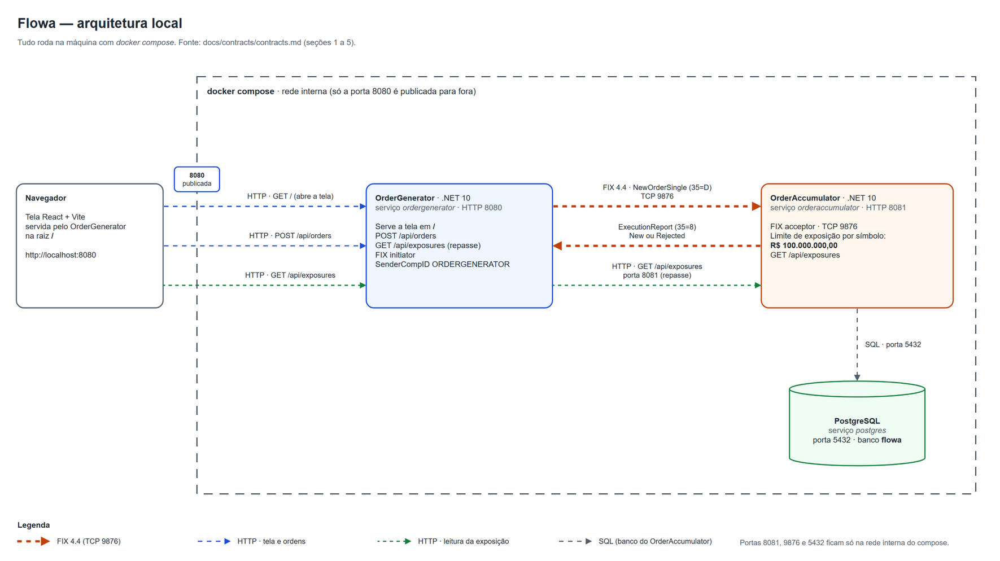
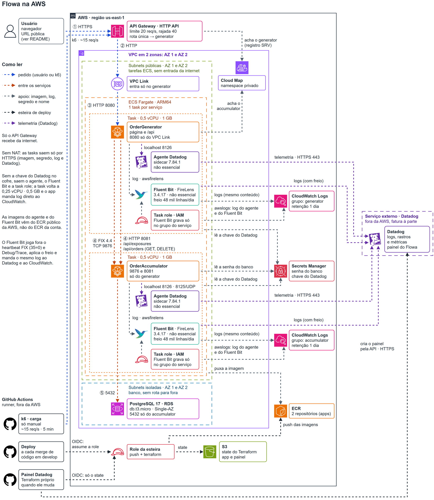
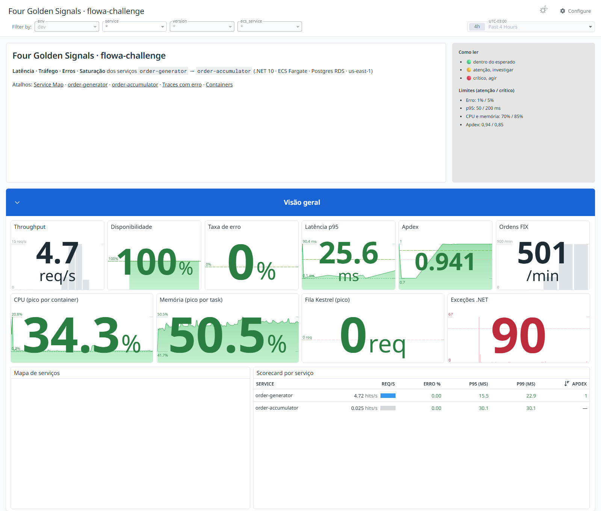
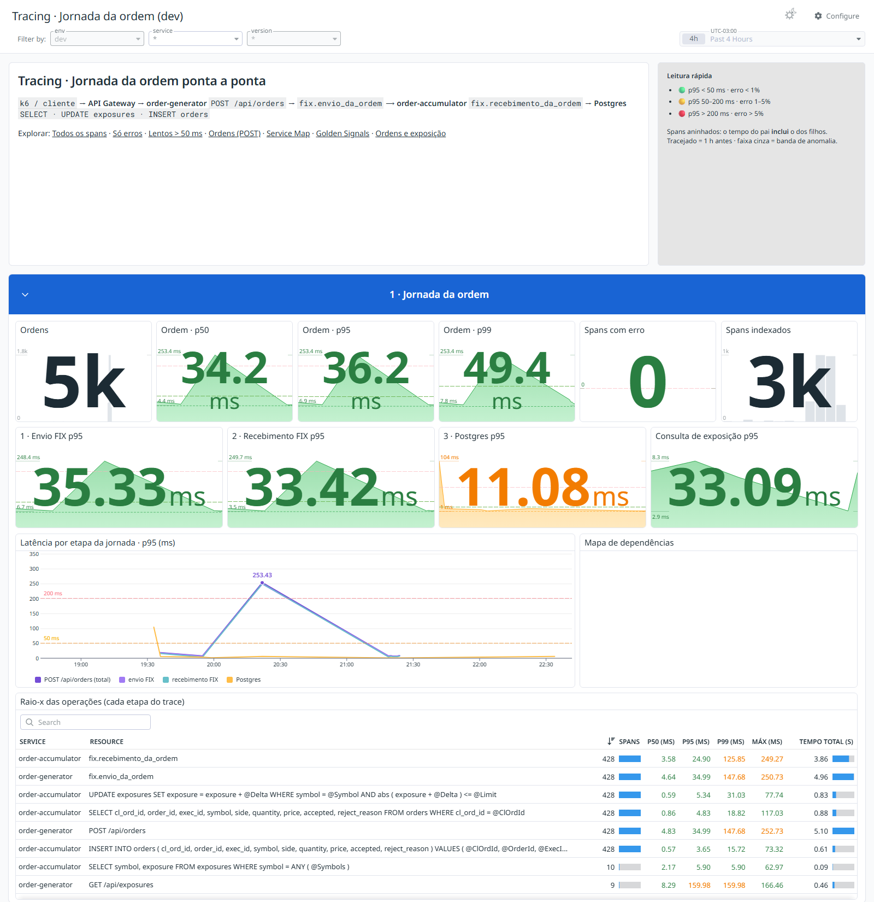

<div align="center">

<a href="#readme">
  <picture>
    <source media="(prefers-color-scheme: dark)" srcset=".github/assets/logo-dark.svg">
    
  </picture>
</a>

<p>
  
  
  
  
</p>

<p>
  <a href="#como-rodar-com-docker"><b>Como rodar</b></a> ·
  <a href="#decisões"><b>Decisões</b></a> ·
  <a href="#na-nuvem-aws"><b>Na nuvem</b></a> ·
  <a href="#observabilidade"><b>Observabilidade</b></a>
</p>

</div>

# Base investimentos

Envio de ordens com FIX 4.4. Duas aplicações em C# que conversam por FIX: o OrderGenerator manda ordens de compra e venda montadas
numa tela, e o OrderAccumulator aceita ou rejeita cada uma conforme o limite de exposição por ativo.

Está no ar em https://h2asgc2sce.execute-api.us-east-1.amazonaws.com (veja [Na nuvem](#na-nuvem-aws)).

## Tecnologias

- C# no .NET 10 (ASP.NET Core) para as duas aplicações
- QuickFIX/n 1.14.1 (`QuickFIXn.Core` e `QuickFIXn.FIX44`) para o protocolo FIX 4.4
- PostgreSQL 17, acessado com Npgsql e Dapper
- React 19, TypeScript e Vite na tela
- xUnit e Testcontainers nos testes do .NET; Vitest e Playwright nos testes da tela
- Docker Compose para subir tudo junto
- GitHub Actions: build e todos os testes em cada PR, e deploy na AWS quando um merge de código chega em `develop`
- AWS (API Gateway, ECS Fargate, RDS), criada só com Terraform
- Datadog para rastros, métricas das ordens e um painel público, com um agente ao lado de cada serviço na AWS
- k6 para o teste de carga, rodado à mão pelo GitHub Actions

## Como rodar com Docker

Precisa só do Docker com o Compose. Na raiz do repositório:

```bash
docker compose up
```

Isso constrói as imagens e sobe o PostgreSQL, o OrderAccumulator e o OrderGenerator. A página fica em
http://localhost:8080 (só nesta máquina). `Ctrl+C` para; `docker compose down -v` apaga também o banco.

A senha do PostgreSQL vem da variável `POSTGRES_PASSWORD`. Sem ela, o compose usa `flowa_dev`, que é um
valor só de desenvolvimento local: o banco não sai da rede interna do compose. Se a 8080 estiver
ocupada, use `FLOWA_HTTP_PORT=9080 docker compose up`.

## Como rodar sem Docker

Precisa do .NET 10 SDK, do Node.js 22 e de um PostgreSQL 17 com um banco `flowa` e um usuário `flowa`.
As tabelas são criadas pelo OrderAccumulator quando ele sobe. Os comandos abaixo são para bash (no
Windows, o Git Bash serve) e usam as portas do contrato: 8080, 8081 e 9876.

Primeiro a tela, que é gravada dentro do OrderGenerator:

```bash
cd frontend
npm ci
npm run build
cd ..
```

Depois o OrderAccumulator, num terminal (troque pela senha que você deu ao usuário `flowa`):

```bash
export POSTGRES_PASSWORD=<senha do usuário flowa>
ASPNETCORE_HTTP_PORTS=8081 Fix__AcceptorPort=9876 \
ConnectionStrings__Flowa="Host=localhost;Port=5432;Database=flowa;Username=flowa;Password=$POSTGRES_PASSWORD" \
dotnet run --no-launch-profile --project src/app-base-order-accumulator-webapi-ecs
```

E o OrderGenerator, em outro terminal:

```bash
ASPNETCORE_HTTP_PORTS=8080 Fix__AcceptorHost=localhost Fix__AcceptorPort=9876 \
OrderAccumulator__BaseUrl=http://localhost:8081 \
dotnet run --no-launch-profile --project src/app-base-order-generator-webapi-ecs
```

A página abre em http://localhost:8080. O `--no-launch-profile` faz o app usar as portas das
variáveis em vez das do `launchSettings.json`. Os dois apps gravam o commit do build e mostram em
`/version`, então precisam ser compilados dentro de um clone do git.

## Como testar

Os testes do .NET precisam do .NET 10 SDK e do Docker de pé, porque os do OrderAccumulator sobem um
PostgreSQL de verdade com Testcontainers:

```bash
dotnet build Flowa.slnx
dotnet test Flowa.slnx --filter "Category!=Integration"
```

Os testes de integração sobem o compose inteiro em projetos separados (portas 18080 e 18093). Eles
conferem a ida e volta FIX entre os containers e a religação depois de recriar o OrderAccumulator. Um
deles clona o repositório, então também precisa do `git`:

```bash
dotnet test tests/Base.IntegrationTests/Base.IntegrationTests.csproj
```

Na tela, dentro de `frontend/`: `npm test` roda os testes de unidade. Para o teste de ponta a ponta,
deixe a aplicação de pé em http://localhost:8080 (com `docker compose up`, por exemplo) e rode
`npx playwright install chromium` uma vez, depois `npm run e2e`.

## Decisões

**Quem inicia a sessão FIX.** O OrderGenerator é o initiator e o OrderAccumulator é o acceptor. Quem
decide fica parado esperando, e quem manda a ordem é quem liga. Se o OrderAccumulator cair, o
OrderGenerator tenta religar a cada 2 segundos e responde erro de comunicação para a tela enquanto
isso, sem travar.

**A regra do limite.** A exposição de um ativo é a soma de preço × quantidade das compras aceitas menos
a das vendas aceitas, então pode ficar negativa. Uma ordem só é aceita se a exposição depois dela
ficar, em valor absoluto, até R$ 100.000.000,00. A borda exata é aceita: o enunciado fala em não passar
do limite, e chegar a 100 milhões não passa. Um centavo acima é rejeitado. As duas bordas têm teste
(`tests/app-base-order-accumulator-webapi-ecs.Tests/IntegrationTests/ExposureRulesTests.cs`).

**Concorrência resolvida no banco.** A exposição só muda num `UPDATE` que testa o limite na própria
cláusula `WHERE`
(`src/app-base-order-accumulator-webapi-ecs/Infrastructure/Persistence/ExposureRepository.cs`). Se a ordem não couber,
nenhuma linha muda e ela é rejeitada. Como o PostgreSQL trava a linha durante o `UPDATE`, duas ordens
ao mesmo tempo no mesmo ativo não conseguem passar juntas do limite. Isso não depende de lock em
memória e continuaria valendo com mais de uma instância. Há um teste com 200 ordens simultâneas,
repetido cinco vezes.

**PostgreSQL.** A exposição precisa sobreviver a um reinício do OrderAccumulator, e o banco já resolve
a concorrência do jeito acima. As tabelas são criadas na subida, com `IF NOT EXISTS`.

**Ordem repetida.** O `ClOrdID` de cada ordem é único no banco. Se a mesma `NewOrderSingle` chegar duas
vezes, a segunda não mexe na exposição: o OrderAccumulator devolve o mesmo `ExecutionReport` da
primeira vez, com o mesmo resultado e o mesmo motivo.

**Ordem aceita entra inteira na exposição.** O enunciado fala em somar a "quantidade executada". Aqui
nenhuma ordem é executada: o OrderAccumulator só aceita ou rejeita. A ordem aceita volta com
`ExecType = New` (150=0), `CumQty` 0 e `LeavesQty` igual à quantidade, e mesmo assim a quantidade
inteira entra na exposição no momento do aceite. Se a exposição esperasse uma execução, ela ficaria
sempre em zero e o limite nunca barraria nada.

**A regra de campo mora só no OrderAccumulator.** Símbolo, lado, quantidade e preço são validados pelo
OrderAccumulator, no que chega pelo FIX
(`src/app-base-order-accumulator-webapi-ecs/Domain/Orders/OrderFieldRule.cs`). Campo inválido volta como ordem rejeitada, com o motivo em
português, igual a uma ordem rejeitada pelo limite. O que nem cabe numa ordem FIX (campo faltando, tipo
errado, lado desconhecido) o OrderGenerator responde com erro 400, sem mandar nada. A tela mantém um
aviso local que aparece antes do envio, só para avisar cedo: ele não é a proteção, e o OrderAccumulator
valida mesmo que a tela seja burlada.

## Limitações conhecidas

- Não há login nem autenticação, nem nas rotas HTTP nem na sessão FIX. A sessão é reconhecida só pelos
  nomes `ORDERGENERATOR` e `ORDERACCUMULATOR`.
- Os ativos são fixos (PETR4, VALE3 e VIIA4) e o limite é uma constante no código, não configuração.
- A ordem não é executada: ela só é aceita ou rejeitada. Não existe casamento de ordens nem preenchimento.
- As mensagens FIX ficam em memória e a numeração recomeça a cada logon. Uma mensagem perdida numa queda
  não é reenviada; o OrderGenerator responde erro de comunicação depois de 5 segundos.
- A proteção contra ordem repetida vale para o `ClOrdID` no FIX. Se a tela enviar a mesma ordem de novo,
  ela ganha um `ClOrdID` novo e conta como outra ordem.
- Não há migrações versionadas do banco: o esquema é criado na subida do OrderAccumulator.
- Na AWS cada serviço roda uma cópia só. No deploy a cópia velha para antes de a nova subir, então a
  aplicação fica fora do ar por alguns instantes.

## Como funciona



A tela é servida pelo próprio OrderGenerator. Quando você envia uma ordem, a tela chama
`POST /api/orders`. O OrderGenerator só confere se o pedido tem o formato de uma ordem e manda uma
`NewOrderSingle` (35=D) por FIX para o OrderAccumulator. O OrderAccumulator confere os campos, aplica a
regra do limite no PostgreSQL e responde com um `ExecutionReport` (35=8): `New` quando aceita, `Rejected` com o motivo
quando não aceita. O OrderGenerator devolve essa resposta para a tela.

O painel de exposição chama `GET /api/exposures` no OrderGenerator, que só repassa a pergunta para o
OrderAccumulator. A fonte do desenho fica em `docs/architecture/arquitetura-local.drawio` e o contrato
entre as partes (rotas, mensagens FIX, portas) em `docs/contracts/contracts.md`.

### Termos do negócio no código

O texto deste README fala em português; o código usa os nomes em inglês abaixo.

- **Ordem**: `Order`, no Domain do OrderAccumulator. A que chega pelo FIX é a `IncomingOrder`; a que o
  OrderGenerator manda é a `OrderToSend`.
- **Ativo**: o `Symbol` da ordem (PETR4, VALE3, VIIA4).
- **Lado** (compra ou venda): `OrderSide`.
- **Exposição de um ativo**: `SymbolExposure`.
- **Limite de exposição**: `ExposureLimitPolicy`.
- **Regra de campo**: `OrderFieldRule`.
- **Resposta da ordem**: a mensagem FIX `ExecutionReport`.
- **Número da ordem**: o `ClOrdID` do FIX, `ClOrdId` no código.

### Como o código é organizado

Cada app é um projeto .NET só (`OrderGenerator.csproj` e `OrderAccumulator.csproj`, na solução
`Flowa.slnx`). As camadas são pastas, com o namespace igual à pasta (`Base.OrderAccumulator.Domain`, por
exemplo):

- **Entrypoint**: rotas HTTP, a sessão FIX do OrderAccumulator e a montagem das dependências. Recebe o
  pedido, chama o caso de uso e responde.
- **Application**: os casos de uso. Cada um só organiza o passo a passo, sem regra de negócio.
- **Domain**: as regras do negócio: a ordem, a regra de campo, o limite de exposição. Não usa nenhuma
  biblioteca de fora.
- **Infrastructure**: PostgreSQL, cliente FIX, Datadog e log. Fora daqui, só o Entrypoint usa biblioteca
  de fora: a QuickFIX/n na sessão FIX do OrderAccumulator e o Npgsql ao montar a conexão.
- **Commons**: só contratos que as outras camadas usam, como a interface do log.

As dependências só apontam para dentro: o Domain não conhece nenhuma outra camada. Um teste de cada app
confere isso lendo o código compilado (`tests/*.Tests/Camadas/LayerDependencyTests.cs`).

Dentro da Application há uma pasta por assunto do negócio, e cada fluxo é uma pasta com um caso de uso só.
No OrderAccumulator as pastas `Orders` e `Exposures` têm o mesmo nome no Domain, onde ficam as regras. No
OrderGenerator só `Orders` tem Domain: a exposição ali é só repassada do OrderAccumulator, sem regra.

```
src/app-base-order-accumulator-webapi-ecs/
├─ Entrypoint/        rotas HTTP, sessão FIX (NewOrderSingleConsumer) e workers
├─ Application/
│  ├─ Orders/
│  │  ├─ DecideIncomingOrder/   decide se a ordem que chegou pelo FIX é aceita
│  │  ├─ ListOrders/            lista as ordens para a tela
│  │  └─ DeleteAllOrders/       apaga as ordens e zera a exposição
│  └─ Exposures/
│     └─ GetExposures/          exposição de cada ativo para o painel
├─ Domain/
│  ├─ Orders/         Order, regra de campo, IOrderRepository
│  └─ Exposures/      SymbolExposure, limite de exposição, IExposureRepository
├─ Infrastructure/    Persistence, Fix, Metrics, Logging
└─ Commons/

src/app-base-order-generator-webapi-ecs/
├─ Entrypoint/        rotas HTTP e a página
├─ Application/
│  ├─ Orders/
│  │  ├─ SendOrder/         manda a ordem por FIX e devolve a resposta
│  │  ├─ ListOrders/        repassa a lista de ordens do OrderAccumulator
│  │  └─ DeleteAllOrders/   repassa o "apagar tudo" ao OrderAccumulator
│  └─ Exposures/
│     └─ GetExposures/      repassa a exposição de cada ativo
├─ Domain/
│  └─ Orders/         OrderToSend, SentOrderResult
├─ Infrastructure/    cliente FIX, cliente HTTP do OrderAccumulator, rastro, log
└─ Commons/
```

Cada agregado tem um repositório só: `IOrderRepository` e `IExposureRepository`, com a interface no Domain
e o código do PostgreSQL na Infrastructure.

## Na nuvem (AWS)

A aplicação está publicada em https://h2asgc2sce.execute-api.us-east-1.amazonaws.com. É a mesma tela
da versão local, e as ordens vão para um PostgreSQL de verdade na AWS.



O navegador fala só com o API Gateway. Ele passa o pedido por um VPC Link para o OrderGenerator, que
roda no ECS Fargate. O OrderGenerator acha o OrderAccumulator pelo Cloud Map e conversa com ele por FIX,
como na versão local. O OrderAccumulator grava num RDS PostgreSQL que fica numa subnet sem saída para
fora. Nenhuma tarefa aceita conexão vinda da internet. Cada serviço roda uma cópia com 0,5 vCPU e
1 GB, que o app divide com o agente do Datadog, o banco é um `db.t3.micro` numa zona só, e o API
Gateway aceita até 20 pedidos por segundo (rajada de 40); acima disso responde 429.

**Como publica.** Os serviços, a rede, o banco, o ECR e os logs são criados pelo Terraform de `infra/`.
A role que a esteira assume e o bucket do state vêm de uma base Terraform separada, fora deste
repositório. Nada é criado pelo console. Quando um PR que muda código é mesclado em `develop`, o
workflow `.github/workflows/2-develop.yml` roda o CI no mesmo commit e, com ele verde, constrói só a
imagem do serviço que mudou, manda para o ECR e roda o `terraform apply`. Merge só de texto (`*.md` e
`docs/`) não publica nada. O GitHub entra na AWS por OIDC, com uma credencial temporária, sem chave
guardada no repositório. A fonte do desenho fica em `docs/architecture/arquitetura-aws.drawio`.

## Observabilidade

São três painéis no Datadog, todos públicos e sem login. Os prints são da noite do teste de carga
(03/10/2026, horário de Brasília).

**[Four Golden Signals](https://p.datadoghq.com/sb/63578a59-bd12-11f1-a546-261a98ac5284-a9e17306767d8f22537a7acb53350942)**:
latência, tráfego, erros e saturação dos dois serviços.



**[Ordens e exposição](https://p.datadoghq.com/sb/63578a59-bd12-11f1-a546-261a98ac5284-cb393cd3b3760676912c981fa71f3372)**:
taxa de aceite, ordens aceitas e rejeitadas e a exposição de cada ativo perto do limite de 100 milhões.


**[Jornada da ordem](https://p.datadoghq.com/sb/63578a59-bd12-11f1-a546-261a98ac5284-b5d1b14c994996116b3fe646ff8d78d5)**:
o rastro de cada ordem, do `POST /api/orders` até o Postgres, passando pelo FIX, com o tempo de cada etapa.



Na AWS, cada task roda um agente do Datadog ao lado do app. Os dois apps mandam rastros para o agente
em `localhost:8126`, o OrderAccumulator manda também métricas em `localhost:8125`, e o agente envia
tudo ao Datadog por HTTPS. Uma ordem
aparece como um rastro só, da tela até o OrderAccumulator: o OrderGenerator põe o contexto do rastro
numa tag FIX própria da `NewOrderSingle`, a 5100 (`TraceParent`), e o OrderAccumulator continua o
mesmo rastro (`Infrastructure/Fix/FixOrderTraceProvider.cs` em cada app). O OrderAccumulator conta
`flowa.ordens.aceitas` e `flowa.ordens.rejeitadas` por ativo e lado, e publica `flowa.exposicao` por
ativo (`src/app-base-order-accumulator-webapi-ecs/Infrastructure/Metrics/DatadogOrderMetricsAdapter.cs`). O ClOrdID não vira etiqueta, para o
número de séries ficar pequeno.

A esteira só põe o agente nas tasks quando o cofre do Datadog no Secrets Manager já tem a chave
(`infra/datadog-agente.tf`, variável `datadog_ligado`). O painel de ordens e exposição nasceu no
Terraform de `observability/datadog/`, aplicado pelo workflow
`.github/workflows/2-develop-painel-datadog.yml`, com quatro gráficos. Depois ele foi ampliado direto no
Datadog, e essa versão, a do print, ainda não voltou para o código: um novo apply desse workflow volta o
painel aos quatro gráficos. Os outros dois painéis foram montados direto no Datadog e não estão no
repositório. As chaves do Datadog ficam no Secrets Manager e nos secrets do GitHub, nunca no
repositório. A conta do Datadog está no período de teste grátis até 15/10/2026; sem
plano contratado, os três painéis param de receber dado novo depois disso.

### Teste de carga

O k6 (`k6/carga-ordens.js`) manda cerca de 15 ordens por segundo durante 5 minutos, abaixo do limite
de 20 por segundo do API Gateway. Em PETR4, VALE3 e VIIA4 ele provoca três resultados:

- **Aceitas:** pares de compra e venda do mesmo ativo, quantidade e preço, que se compensam.
- **Rejeitadas por campo inválido:** quantidade 100000, que passa pelo FIX e volta rejeitada.
- **Rejeitadas por limite:** ordens grandes enchem a exposição até a seguinte passar de
  R$ 100.000.000,00 e voltar rejeitada. Depois o k6 desfaz o que a API aceitou, olhando a exposição real.

O teste reprova se faltar algum dos três resultados em algum ativo, se a exposição de algum ativo não
voltar ao valor de antes, se o k6 não conseguir manter o ritmo ou se a taxa de erro chegar a 1%.

Medição na máquina, contra o `docker compose` do commit 62979f4 (5 minutos, 4523 ordens):

| Ativo | Aceitas | Rejeitadas por campo | Rejeitadas por limite | Exposição antes e depois |
|---|---|---|---|---|
| PETR4 | 1406 | 101 | 2 | igual |
| VALE3 | 1404 | 101 | 2 | igual |
| VIIA4 | 1404 | 101 | 2 | igual |

| Requisições por minuto | Taxa de erro | P80 | P90 | P95 | P99 |
|---|---|---|---|---|---|
| 904 | 0,00% | 5 ms | 5 ms | 5 ms | 6 ms |

Para rodar no ambiente dev: em Actions, escolha o workflow `k6-carga.yml` e clique em "Run workflow".
Só rode quando ninguém mais estiver mandando ordens para dev, senão a exposição não fecha. O resumo
aparece na página do run e fica como anexo. Na máquina: `k6 run -e FLOWA_URL=http://localhost:8080 k6/carga-ordens.js`.

This is a challenge by [Coodesh](https://coodesh.com/)
