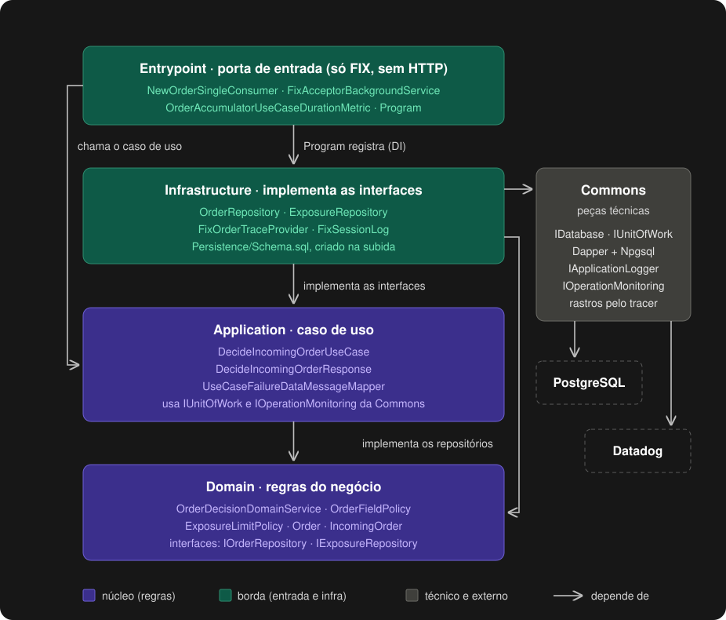

<div align="center">

<a href="#readme">
  <picture>
    <source media="(prefers-color-scheme: dark)" srcset=".github/assets/logo-dark.svg">
    
  </picture>
</a>

<h3>Envio de ordens com FIX 4.4</h3>

<p>Três aplicações em C#: uma manda ordens de compra e venda por FIX, outra aceita ou rejeita cada uma<br>
conforme o limite de exposição por ativo, e a terceira manda as métricas ao Datadog.</p>

<p>
  
  
  
  
  
  
</p>

<p>
  <a href="https://h2asgc2sce.execute-api.us-east-1.amazonaws.com"><b>Ver no ar na AWS</b></a> ·
  <a href="#começando"><b>Como rodar</b></a> ·
  <a href="#testes"><b>Testes</b></a> ·
  <a href="#decisões-de-projeto"><b>Decisões</b></a> ·
  <a href="#na-nuvem-aws"><b>Na nuvem</b></a> ·
  <a href="#observabilidade-com-datadog"><b>Observabilidade com Datadog</b></a>
</p>

</div>

<br>

<details>
<summary><b>Índice</b></summary>

- [Sobre o projeto](#sobre-o-projeto)
- [Funcionalidades](#funcionalidades)
  - [A boleta (OrderGenerator)](#a-boleta-ordergenerator)
  - [A decisão (OrderAccumulator)](#a-decisão-orderaccumulator)
  - [Também na tela e na operação](#também-na-tela-e-na-operação)
- [Stack](#stack)
- [Arquitetura](#arquitetura)
  - [Termos do negócio no código](#termos-do-negócio-no-código)
  - [Como o código é organizado](#como-o-código-é-organizado)
- [Começando](#começando)
  - [Com Docker](#com-docker)
  - [Sem Docker](#sem-docker)
- [Testes](#testes)
  - [Como rodar os testes](#como-rodar-os-testes)
- [Decisões de projeto](#decisões-de-projeto)
- [Limitações conhecidas](#limitações-conhecidas)
- [Na nuvem (AWS)](#na-nuvem-aws)
- [Observabilidade com Datadog](#observabilidade-com-datadog)
  - [Rastreabilidade pelo traceId](#rastreabilidade-pelo-traceid)
  - [Os painéis](#os-painéis)
  - [Como os dados chegam](#como-os-dados-chegam)
  - [Teste de carga](#teste-de-carga)
- [Estrutura de pastas](#estrutura-de-pastas)
- [Clean Architecture na prática](#clean-architecture-na-prática)
- [Contribuindo](#contribuindo)

</details>

> [!TIP]
> Clique em qualquer imagem para vê-la em tamanho real. Os prints do Datadog abrem e fecham clicando no título.

## Sobre o projeto

A **Base investimentos** é uma boleta de ordens de ações para quem opera. O **OrderGenerator** mostra uma tela onde você monta ordens de
compra e venda e as manda pelo protocolo FIX 4.4, o padrão do mercado financeiro, para o **OrderAccumulator**.
Ele decide: aceita ou rejeita, conforme o limite de exposição por ativo, e a resposta volta para a tela. O que o
sistema protege é o risco: nenhuma ordem pode deixar a exposição de um ativo passar de R$ 100 milhões.

Um terceiro programa, o **worker de métricas**, lê o banco a cada 5 minutos e manda ao Datadog a exposição e a
contagem de ordens aceitas e rejeitadas.

> [!IMPORTANT]
> **A aplicação está no ar na AWS:** https://h2asgc2sce.execute-api.us-east-1.amazonaws.com. Ela roda em
> ECS Fargate, atrás de um API Gateway, com o banco num RDS PostgreSQL (veja [Na nuvem](#na-nuvem-aws)).

## Funcionalidades

O OrderGenerator e o OrderAccumulator conversam pelo protocolo FIX, versão 4.4, com a biblioteca
[QuickFIX/n](https://quickfixn.org/).

### A boleta (OrderGenerator)

O OrderGenerator mostra numa página web a caixa **Nova ordem**. Cada envio vira uma nova ordem FIX, a
`NewOrderSingle` (35=D).

| Campo | Como preencher |
|---|---|
| **Símbolo** | PETR4, VALE3 ou VIIA4 |
| **Lado** | Compra ou Venda |
| **Quantidade** | Número inteiro, maior que zero e menor que 100.000 |
| **Preço** | Valor maior que zero, em centavos inteiros (múltiplo de 0,01) e menor que R$ 1.000,00 |

A resposta de cada envio aparece na própria tela, com o selo **Aceita** ou **Rejeitada** e o motivo, e a ordem
entra na lista **Compra/Venda**.

### A decisão (OrderAccumulator)

O OrderAccumulator recebe as ordens e calcula a **exposição financeira** de cada símbolo:

```
exposição = soma de (preço × quantidade) das compras aceitas
          − soma de (preço × quantidade) das vendas aceitas
```

Compra aumenta a exposição; venda diminui, e ela pode ficar negativa. O limite é fixo, de
**R$ 100.000.000,00 por símbolo**. A ordem que faria a exposição passar desse limite, em valor absoluto, é
rejeitada. Chegar exatamente no limite é aceito; um centavo acima é rejeitado.

| Resultado | Resposta FIX | Entra na exposição? |
|---|---|---|
| **Aceita** | `ExecutionReport` com `ExecType = New` | Sim, inteira, com a quantidade pedida |
| **Rejeitada** | `ExecutionReport` com `ExecType = Rejected`, com o motivo em português | Não |

Os campos são conferidos aqui: uma ordem fora das regras da boleta volta rejeitada, mesmo que a tela seja burlada.
O OrderAccumulator não tem HTTP: ele só escuta o FIX.

### Também na tela e na operação

| Funcionalidade | O que a pessoa faz | O que o sistema responde |
|---|---|---|
| Ver a exposição | olha o quadro **Exposição por ativo** | a exposição de cada ativo e o quanto falta para o limite, lida direto do banco |
| Ver as ordens | olha a lista **Compra/Venda** | as ordens enviadas, da mais nova para a mais velha, com status e motivo da rejeição, em páginas |
| Apagar tudo | clica em **Deletar tudo** e confirma | apaga todas as ordens e zera a exposição dos três ativos, numa transação só |
| Modo de teste | dá duplo clique no símbolo | a tela para de conferir os campos e envia como está, para ver o OrderAccumulator rejeitar |
| Ordem repetida | manda de novo o mesmo número de ordem (`ClOrdID`) pelo FIX | a mesma resposta da primeira vez, sem contar de novo; com outros dados, rejeitada como duplicada |
| Métricas no Datadog | nada: acontece sozinho | a cada 5 minutos, a exposição de cada ativo e a contagem de ordens aceitas e rejeitadas |
| Painéis no Datadog | abre os links públicos | latência, erros, métricas de negócio e o rastro de cada ordem |

## Stack

| Camada | Tecnologia | Versão |
|---|---|---|
| Aplicações | C# no .NET (ASP.NET Core no OrderGenerator; workers no OrderAccumulator e no worker de métricas) | 10 |
| Protocolo | QuickFIX/n (`QuickFIXn.Core` e `QuickFIXn.FIX44`) | 1.14.1, FIX 4.4 |
| Banco | PostgreSQL, com Npgsql e Dapper | 17 |
| Tela | React, TypeScript e Vite | React 19 |
| Testes .NET | xUnit, NetArchTest, WebApplicationFactory e Testcontainers (PostgreSQL) | xUnit 2.9, Testcontainers 4.15 |
| Testes da tela | Vitest (unitários) e Playwright (E2E) | Vitest 5, Playwright 1.63 |
| Carga | k6, rodado à mão pelo GitHub Actions | |
| Local | Docker Compose | |
| Nuvem | AWS (API Gateway, ECS Fargate, RDS), só com Terraform | |
| Esteira | GitHub Actions: build e testes em cada PR, deploy na AWS no merge de código em `develop` | |
| Observabilidade | Datadog: APM com dd-trace-dotnet, logs JSON por Fluent Bit e métricas por DogStatsD (só o worker de métricas) | dd-trace-dotnet 3.54 |

## Arquitetura


<sub>Clique no desenho para vê-lo em tamanho real. Fonte em draw.io: <code>docs/architecture/arquitetura-local.drawio</code>.</sub>

1. A tela é servida pelo próprio OrderGenerator. Ao enviar uma ordem, ela chama `POST /api/orders`.
2. O OrderGenerator só confere se o pedido tem o formato de uma ordem e manda uma `NewOrderSingle`
   (35=D) por FIX para o OrderAccumulator.
3. O OrderAccumulator confere os campos, aplica a regra do limite no PostgreSQL e responde com um
   `ExecutionReport` (35=8): `New` quando aceita, `Rejected` com o motivo quando não aceita.
4. O OrderGenerator devolve essa resposta para a tela.

O quadro de exposição chama `GET /api/exposures` no OrderGenerator, que lê a exposição direto no PostgreSQL, na
tabela que o OrderAccumulator grava. A lista de ordens (`GET /api/orders`) e o "apagar tudo"
(`DELETE /api/orders`) seguem o mesmo caminho: funcionam mesmo com o OrderAccumulator parado; só o envio de ordem
falha enquanto ele não volta. Não há HTTP entre o OrderGenerator e o OrderAccumulator, só FIX. As duas pontas do
FIX usam o mesmo dicionário, `src/flowa.commons/Fix/FIX44-flowa.xml`.

O worker de métricas não fala com nenhum dos dois apps. A cada 5 minutos ele lê no mesmo banco a exposição de cada
ativo e as ordens que chegaram desde a última leitura, e manda as métricas ao agente do Datadog. Na sua máquina não
há agente, então ele só escreve no log o que mandaria. O contrato entre as partes (rotas, mensagens FIX, portas e o
worker) fica em `docs/contracts/contracts.md`.

### Termos do negócio no código

O texto deste README fala em português; o código usa os nomes em inglês abaixo.

| No README | O que é | No código |
|---|---|---|
| Ordem | pedido de compra ou venda de um ativo | `Order`, no Domain do OrderAccumulator. A que chega pelo FIX é a `IncomingOrder`; a que o OrderGenerator manda é a `OrderToSend` |
| Ativo | a ação negociada (PETR4, VALE3, VIIA4) | o `Symbol` da ordem |
| Lado | compra ou venda | `OrderSide` |
| Exposição de um ativo | soma das compras aceitas menos a das vendas aceitas, em reais | `SymbolExposure` |
| Limite de exposição | R$ 100.000.000,00 por ativo | `ExposureLimitPolicy` |
| Regras de campo | o que cada campo da ordem pode ter | `OrderFieldPolicy` |
| Decisão de aceitar ou rejeitar | o passo que confere os campos e o limite | `OrderDecisionDomainService` |
| Resposta da ordem | aceita (`New`) ou rejeitada (`Rejected`) | a mensagem FIX `ExecutionReport` |
| Número da ordem | identificador único de cada ordem no FIX | o `ClOrdID` do FIX, `ClOrdId` no código |

### Como o código é organizado

Cada app é um projeto .NET só (`OrderGenerator.csproj`, `OrderAccumulator.csproj` e `DatadogMetrics.csproj`), e o
código técnico que os três usam fica num quarto projeto, a Commons (`src/flowa.commons/Commons.csproj`). Todos
estão na solução `Flowa.slnx`, junto com os projetos de teste. As camadas são pastas, com o namespace igual à pasta
(`Flowa.OrderAccumulator.Domain`, por exemplo).

| Camada | O que faz | Pode depender de |
|---|---|---|
| **Entrypoint** | A porta de entrada de cada app e a montagem das dependências: no OrderGenerator, as rotas HTTP, o tratamento de erro e o log de cada pedido; no OrderAccumulator, que não tem HTTP, a sessão FIX (`NewOrderSingleConsumer`); no worker de métricas, o laço de 5 minutos | Todas as camadas |
| **Application** | Os casos de uso (`UseCases`), as portas que eles usam (`Interfaces`) e o que devolvem (`Responses`). Cada um só organiza o passo a passo, sem regra de negócio | Domain e Commons |
| **Domain** | As regras do negócio: a ordem, as regras de campo, o limite de exposição e as interfaces dos repositórios | Só a biblioteca padrão do .NET e a base das entidades da Commons |
| **Infrastructure** | O que implementa as interfaces: o SQL do PostgreSQL, o cliente FIX e, no worker, as métricas do Datadog | Domain, Application e Commons; nunca o Entrypoint. Banco e Datadog só pela Commons |
| **Commons** | Peças técnicas dos três apps: banco (Dapper e Npgsql atrás de `IDatabase`), unidade de trabalho, log, observabilidade, o envelope `DataMessage`, a base das entidades e o dicionário FIX | Cada pasta só usa a sua biblioteca técnica |

Só a Commons usa Dapper, Npgsql e o cliente do Datadog; a QuickFIX/n fica só nos arquivos de FIX. Um teste de cada
app confere essas dependências lendo o código compilado (`tests/*.Tests/Camadas/LayerDependencyTests.cs`). O
desenho das camadas está em [Clean Architecture na prática](#clean-architecture-na-prática).

<details>
<summary><b>Ver as pastas de cada app</b></summary>

```
src/flowa.orderaccumulator-worker-ecs/
├─ Entrypoint/
│  ├─ Fix/                  NewOrderSingleConsumer: recebe a ordem FIX e responde o ExecutionReport
│  ├─ BackgroundService/    sessão FIX (acceptor)
│  └─ Observability/
├─ Application/
│  ├─ Orders/       DecideIncomingOrder (UseCases), Responses
│  └─ ErrorHandling/
├─ Domain/
│  ├─ Orders/           Order, regras de campo (OrderFieldPolicy), IOrderRepository
│  ├─ Exposures/        limite de exposição, IExposureRepository
│  └─ DomainServices/   OrderDecisionDomainService
└─ Infrastructure/
   ├─ Orders/, Exposures/    Repositories (SQL); em Orders, também Options
   ├─ Fix/                   rastro na tag 5100 e log da sessão FIX
   ├─ Persistence/           Schema.sql, criado na subida
   └─ DependencyInjection/

src/flowa.ordergenerator-webapi-ecs/
├─ Entrypoint/
│  ├─ Orders/, Exposures/   rotas HTTP e o pedido da ordem
│  └─ DependencyInjection/, ErrorHandling/, Logging/, Observability/
├─ Application/
│  ├─ Orders/       SendOrder, ListOrders e DeleteAllOrders (UseCases), Commands, Responses, Interfaces
│  ├─ Exposures/    GetExposures (UseCases), Responses, Interfaces
│  └─ ErrorHandling/
├─ Domain/
│  ├─ Orders/       OrderToSend, SentOrderResult, formato da ordem
│  └─ Exposures/    SymbolExposure, limite de exposição
└─ Infrastructure/
   ├─ Fix/                   cliente FIX (FixOrderClient), rastro e log da sessão
   ├─ Orders/, Exposures/    Repositories: lista, exposição e "apagar tudo" no PostgreSQL;
   │                         em Orders, também Options (prazo do FIX)
   └─ DependencyInjection/

src/flowa.datadog-metrics-worker-ecs/
├─ Entrypoint/
│  ├─ BackgroundService/    DatadogMetricsBackgroundService: o laço de 5 minutos
│  └─ DependencyInjection/, Observability/
├─ Application/
│  ├─ Exposures/    SendSymbolExposureGauges (UseCases), Interfaces
│  ├─ Orders/       SendAnsweredOrderCounts (UseCases), Commands, Responses, Interfaces
│  └─ ErrorHandling/
├─ Domain/
│  ├─ Exposures/    SymbolExposure
│  └─ Orders/       AnsweredOrderCount, OrderSide, OrderSymbolPolicy
└─ Infrastructure/
   ├─ Exposures/, Orders/    Repositories (leitura no PostgreSQL) e Adapters (métricas do Datadog)
   └─ DependencyInjection/

src/flowa.commons/
├─ Database/, Logging/, Observability/, Responses/, Entities/, DependencyInjection/
└─ Fix/             FIX44-flowa.xml, o dicionário FIX dos dois apps
```

</details>

A página não fica no OrderGenerator: o código dela está em `frontend/`, e o build do Vite vai para o `wwwroot`
dele. No OrderAccumulator, cada agregado tem um repositório: `IOrderRepository` e `IExposureRepository`, com a
interface no Domain e o SQL na Infrastructure. As leituras da tela têm repositório próprio, com a interface na
Application do OrderGenerator: `IStoredOrderRepository` e `ISymbolExposureRepository`.

## Começando

### Com Docker

Precisa ter instalado: **Git** e **Docker Desktop** (aberto).

**1. Baixar o projeto:**

```bash
git clone https://github.com/escolaparaprogramadores/flowa_challange.git
cd flowa_challange
```

**2. Subir tudo:**

```bash
docker compose up
```

Isso sobe quatro partes juntas: o PostgreSQL, o OrderAccumulator, o OrderGenerator com a tela e o worker de
métricas do Datadog. A primeira vez demora alguns minutos.

**3. Abrir a tela:** http://localhost:8080

Para parar: `Ctrl+C`. Para parar e apagar as ordens salvas: `docker compose down -v`.

Se a porta 8080 estiver ocupada: `FLOWA_HTTP_PORT=9080 docker compose up` e abra http://localhost:9080.

> [!IMPORTANT]
> Baixe com `git clone`, não pelo botão "Download ZIP". O build da imagem lê o commit da pasta `.git`, que
> o ZIP não traz, e para com o erro `No commit`.

#### Se algo der errado

| O que acontece | Por quê | O que fazer |
|---|---|---|
| `docker compose up` para logo no começo com erro de conexão com o Docker | o Docker não está rodando | Abra o Docker Desktop e espere ele dizer que está rodando (no Linux, `sudo systemctl start docker`). Depois rode `docker compose up` de novo. |
| Erro dizendo que a porta 8080 já está em uso (`port is already allocated` ou `ports are not available`) | outro programa usa a 8080 | Escolha outra porta com `FLOWA_HTTP_PORT` e abra a página nela. No bash (Mac, Linux, Git Bash): `FLOWA_HTTP_PORT=9080 docker compose up`. No PowerShell: `$env:FLOWA_HTTP_PORT="9080"; docker compose up`. A página fica em http://localhost:9080. |
| A primeira subida demora | o Docker baixa as imagens base e compila os três apps e a tela | Espere. As próximas vezes usam o cache e sobem em segundos. Está pronto quando a página abre. |
| A página abre com exposição zero e lista vazia, logo depois de subir | na primeira subida o OrderAccumulator ainda está criando as tabelas; enquanto isso o OrderGenerator responde exposição zero e lista vazia, sem erro | Espere alguns segundos e recarregue a página. |
| Na primeira subida, o log do `datadogmetrics` mostra um erro terminado em `not sent. Trying again on the next cycle.`, por exemplo com `42P01: relation "exposures" does not exist` | o worker de métricas leu o banco antes de o OrderAccumulator criar as tabelas | Nada: 5 minutos depois ele lê de novo e manda normalmente. A página não é afetada. |
| A primeira ordem volta com **Erro de comunicação** | a sessão FIX entre o OrderGenerator e o OrderAccumulator ainda está ligando | Espere alguns segundos e envie de novo. |
| O build para com `"/.git": not found` | o projeto foi baixado em ZIP, sem a pasta `.git` | Baixe com `git clone`, como no passo 1. |
| No Windows, o `git clone` termina com `Filename too long` | o Windows limita o caminho de um arquivo a 260 letras, e a pasta onde você clonou já usa boa parte delas | Apague a pasta criada e clone de novo numa pasta de caminho curto, como `C:\dev`, ou deixe o Git usar caminhos longos: `git clone -c core.longpaths=true https://github.com/escolaparaprogramadores/flowa_challange.git`. |

#### O que precisa estar instalado

Para rodar com Docker não precisa de .NET nem de Node na máquina: o build acontece dentro das imagens.

| Programa | Para quê | Versão usada para testar este README | Como conferir |
|---|---|---|---|
| Git | baixar o projeto | 2.54 | `git --version` |
| Docker Desktop (Windows e Mac) ou Docker Engine (Linux) | construir e rodar as imagens | 29.5.3 | `docker version` |
| Docker Compose v2 ou mais novo, que já vem no Docker Desktop | o `docker compose up` | v5.1.4 | `docker compose version` |

O comando é `docker compose`, com espaço: é o Compose v2 em diante. Se algo falhar e a sua versão for bem mais
antiga que as da tabela, atualize o Docker antes de qualquer outra coisa.

#### O que sobe

| Serviço | O que faz | Porta |
|---|---|---|
| `ordergenerator` | a página e a API (`/api/orders`, `/api/exposures`); manda cada ordem por FIX ao OrderAccumulator e lê a exposição e a lista direto no banco | 8080, só em `127.0.0.1` |
| `orderaccumulator` | worker sem HTTP: recebe a ordem por FIX, confere os campos e o limite e responde aceita ou rejeitada; cria as tabelas na primeira subida | 9876, só na rede interna |
| `datadogmetrics` | worker sem porta: a cada 5 minutos lê o banco e manda ao Datadog a exposição de cada ativo e a contagem de ordens aceitas e rejeitadas | nenhuma |
| `postgres` | PostgreSQL 17, banco `flowa` | 5432, só na rede interna |

Na sua máquina não há agente do Datadog, e isso não é erro: o `datadogmetrics` continua de pé e só escreve no log o
que mandaria. Ao subir, ele escreve `Symbol exposure gauges sent.` e `Order count starts after the stored orders.`;
depois, a cada 5 minutos, `Symbol exposure gauges sent.` e `Answered order counts sent.`. Para ver:
`docker compose logs datadogmetrics`.

A senha do PostgreSQL vem da variável `POSTGRES_PASSWORD`. Sem ela, o compose usa `flowa_dev`, que é um
valor só de desenvolvimento local: o banco não sai da rede interna do compose.

#### Enviar uma ordem aceita e uma rejeitada

O limite é de R$ 100.000.000,00 de exposição por ativo. Uma ordem sozinha não chega lá (a quantidade é menor que
100.000 e o preço, menor que R$ 1.000,00), então a rejeitada vem depois de encher o ativo:

| Passo | Na caixa **Nova ordem** | Clique em | O que aparece |
|---|---|---|---|
| 1. Aceita | **Compra**, **VALE3**, quantidade `99999`, preço `999,99` | **Enviar ordem de compra** | selo **Aceita**; em **Exposição por ativo**, VALE3 vai para R$ 99.998.000,01 |
| 2. Rejeitada | **Compra**, **VALE3**, quantidade `10`, preço `500,00` | **Enviar ordem de compra** | selo **Rejeitada** e a mensagem `Ordem rejeitada: a exposição de VALE3 passaria do limite de 100.000.000,00.`; a exposição de VALE3 não muda |

As duas aparecem na lista **Compra/Venda**, com o status de cada uma. Para voltar ao zero, clique em **Deletar tudo**
na lista e confirme, ou rode `docker compose down -v` e `docker compose up` de novo.

### Sem Docker

<details>
<summary><b>Passo a passo sem Docker</b></summary>

Precisa do .NET 10 SDK, do Node.js 22 e de um PostgreSQL 17 com um banco `flowa` e um usuário `flowa`.
As tabelas são criadas pelo OrderAccumulator quando ele sobe. Os comandos abaixo são para bash (no
Windows, o Git Bash serve) e usam as portas do contrato: 8080 (a página e a API) e 9876 (o FIX).

**1. A tela**, que é gravada dentro do OrderGenerator:

```bash
cd frontend
npm ci
npm run build
cd ..
```

**2. O OrderAccumulator**, num terminal (troque pela senha que você deu ao usuário `flowa`):

```bash
export POSTGRES_PASSWORD=<senha do usuário flowa>
Fix__AcceptorPort=9876 \
ConnectionStrings__Flowa="Host=localhost;Port=5432;Database=flowa;Username=flowa;Password=$POSTGRES_PASSWORD" \
dotnet run --project src/flowa.orderaccumulator-worker-ecs
```

**3. O OrderGenerator**, em outro terminal. Ele lê a lista e a exposição no mesmo banco, com a mesma senha:

```bash
export POSTGRES_PASSWORD=<senha do usuário flowa>
ASPNETCORE_HTTP_PORTS=8080 Fix__AcceptorHost=localhost Fix__AcceptorPort=9876 \
ConnectionStrings__Flowa="Host=localhost;Port=5432;Database=flowa;Username=flowa;Password=$POSTGRES_PASSWORD" \
dotnet run --project src/flowa.ordergenerator-webapi-ecs
```

A página abre em http://localhost:8080. O OrderAccumulator não tem HTTP: ele só escuta o FIX na 9876.
Os dois apps gravam o commit do build e não sobem sem ele (o OrderGenerator mostra em `/version`), então
precisam ser compilados dentro de um clone do git. O worker de métricas não é preciso para a tela funcionar.

</details>

## Testes

Os testes vão do mais rápido ao mais completo. O CI roda todos em cada PR, menos o de carga, que é disparado à mão.

| Tipo | O que confere | Tecnologia | Onde fica |
|---|---|---|---|
| **Unitário (.NET)** | Regras de campo da ordem, limite de exposição, validador de formato do OrderGenerator, log JSON, log da sessão FIX, o rastro que vai na tag 5100 e as métricas do worker | xUnit 2.9 | `tests/*.Tests/UnitTests/` |
| **Arquitetura** | Que cada camada só depende do que pode (Clean Architecture) e que o namespace bate com a pasta | xUnit + NetArchTest 1.3 | `tests/*.Tests/Camadas/` |
| **Integração (.NET)** | O app rodando contra um **PostgreSQL de verdade** e uma sessão FIX de verdade: bordas do limite, 200 ordens simultâneas repetidas cinco vezes, ordem repetida, apagar tudo durante envios, rotas lendo o banco e a leitura do worker de métricas | xUnit, `WebApplicationFactory`, Testcontainers 4.15 e QuickFIX/n | `tests/flowa.ordergenerator-webapi-ecs.Tests/`, `tests/flowa.orderaccumulator-worker-ecs.Tests/`, `tests/flowa.datadog-metrics-worker-ecs.Tests/` |
| **Integração do compose** | Sobe o `docker compose` inteiro em projetos separados (portas 18080 e 18093): ida e volta FIX entre os containers e a religação depois de recriar o OrderAccumulator | xUnit + Docker Compose | `tests/IntegrationTests/` |
| **Unitário da tela** | Validação da ordem, formato de número brasileiro, uso do limite, paginação, chamadas à API e componentes | Vitest 5 | `frontend/src/**/*.test.ts` |
| **Ponta a ponta (E2E)** | A tela de verdade num navegador: boleta, envio de ordem, validação dos campos, lista e paginação, apagar tudo, telas pequenas e a tela com o OrderAccumulator parado | Playwright 1.63 (Chromium) | `frontend/e2e/*.spec.ts` |
| **Carga** | ~15 ordens por segundo durante 5 minutos com os três resultados (veja [Teste de carga](#teste-de-carga)) | k6 | `performance test/` |

### Como rodar os testes

Para os testes, além do Git e do Docker, precisa do [.NET 10 SDK](https://dotnet.microsoft.com/download/dotnet/10.0)
e do [Node.js 22](https://nodejs.org/). Rode tudo na raiz do clone, com o Docker aberto.

**Testes do .NET** (os de integração com o compose clonam o repositório, então também usam o `git`):

```bash
dotnet build Flowa.slnx
dotnet test Flowa.slnx --filter "Category!=Integration"
dotnet test tests/IntegrationTests/IntegrationTests.csproj
```

**Testes da tela.** Os de ponta a ponta precisam da aplicação de pé: deixe o `docker compose up` rodando em outro
terminal. Se você trocou a porta, passe a nova também aqui, com `E2E_BASE_URL=http://localhost:9080`.

```bash
cd frontend
npm ci
npm test
npx playwright install chromium
npm run e2e
```

**Ponta a ponta sem o OrderAccumulator.** Com ele parado, a exposição e a lista continuam aparecendo (vêm do
banco) e só o envio de ordem falha. Ainda dentro de `frontend/`:

```bash
docker compose stop orderaccumulator
npx playwright test -c playwright.without-accumulator.config.ts
docker compose start orderaccumulator
```

**No CI** (`.github/workflows/0-ci-pull-request.yml`), cada PR para `develop` e `main` roda: build e testes
unitários da tela, `dotnet test Flowa.slnx` com todos os testes do .NET, e o Playwright duas vezes com o
`docker compose` de pé: uma com tudo funcionando e outra com o OrderAccumulator parado.

## Decisões de projeto

| Tema | Escolha |
|---|---|
| [Quem inicia a sessão FIX](#quem-inicia-a-sessão-fix) | OrderGenerator liga, OrderAccumulator espera |
| [A regra do limite](#a-regra-do-limite) | Até R$ 100.000.000,00 em valor absoluto, borda aceita |
| [Concorrência](#concorrência-resolvida-no-banco) | Resolvida num `UPDATE` do PostgreSQL |
| [PostgreSQL](#postgresql) | Exposição só no banco, sobrevive a reinício |
| [Ordem repetida](#ordem-repetida) | `ClOrdID` único, mesma resposta |
| [Ordem aceita na exposição](#ordem-aceita-entra-inteira-na-exposição) | Entra inteira no momento do aceite |
| [Regras de campo](#as-regras-de-campo-moram-no-orderaccumulator) | Valem no OrderAccumulator |
| [Leitura da tela](#o-ordergenerator-lê-e-apaga-direto-no-banco) | OrderGenerator lê e apaga no banco; OrderAccumulator só FIX |
| [Métricas](#as-métricas-saem-de-um-worker-separado) | Worker de métricas, a cada 5 minutos |

#### Quem inicia a sessão FIX

O OrderGenerator é o initiator e o OrderAccumulator é o acceptor. Quem decide fica parado esperando, e quem manda a
ordem é quem liga. Se o OrderAccumulator cair, o OrderGenerator tenta religar a cada 2 segundos e responde erro de
comunicação para a tela enquanto isso, sem travar.

#### A regra do limite

A exposição de um ativo é a soma de preço × quantidade das compras aceitas menos a das vendas aceitas, então pode
ficar negativa. Uma ordem só é aceita se a exposição depois dela ficar, em valor absoluto, até R$ 100.000.000,00. A
borda exata é aceita: o enunciado fala em não passar do limite, e chegar a 100 milhões não passa. Um centavo acima é
rejeitado. As duas bordas têm teste
(`tests/flowa.orderaccumulator-worker-ecs.Tests/IntegrationTests/ExposureRulesTests.cs`).

#### Concorrência resolvida no banco

A exposição só muda num `UPDATE` que testa o limite na própria cláusula `WHERE`
(`src/flowa.orderaccumulator-worker-ecs/Infrastructure/Exposures/Repositories/ExposureRepository.cs`). Se a ordem
não couber, nenhuma linha muda e ela é rejeitada. Como o PostgreSQL trava a linha durante o `UPDATE`, duas ordens ao
mesmo tempo no mesmo ativo não conseguem passar juntas do limite. Isso não depende de lock em memória e continuaria
valendo com mais de uma instância. Há um teste com 200 ordens simultâneas, repetido cinco vezes.

#### PostgreSQL

A exposição precisa sobreviver a um reinício do OrderAccumulator, e o banco já resolve a concorrência do jeito acima.
Ela vive só no banco, sem cópia em memória. As tabelas são criadas na subida do OrderAccumulator, com
`IF NOT EXISTS` (`src/flowa.orderaccumulator-worker-ecs/Infrastructure/Persistence/Schema.sql`).

#### Ordem repetida

O `ClOrdID` de cada ordem é único no banco. Se a mesma `NewOrderSingle` chegar duas vezes, a segunda não mexe na
exposição: o OrderAccumulator devolve o mesmo `ExecutionReport` da primeira vez, com o mesmo resultado e o mesmo
motivo. Se o `ClOrdID` repetido vier com outro ativo, lado, quantidade ou preço, ela volta rejeitada como ordem
duplicada (`OrdRejReason` 6) e a primeira fica como estava.

#### Ordem aceita entra inteira na exposição

O enunciado fala em somar a "quantidade executada". Aqui nenhuma ordem é executada: o OrderAccumulator só aceita ou
rejeita. A ordem aceita volta com `ExecType = New` (150=0), `CumQty` 0 e `LeavesQty` igual à quantidade, e mesmo
assim a quantidade inteira entra na exposição no momento do aceite. Se a exposição esperasse uma execução, ela
ficaria sempre em zero e o limite nunca barraria nada.

#### As regras de campo moram no OrderAccumulator

Símbolo, lado, quantidade e preço são validados pelo OrderAccumulator, no que chega pelo FIX
(`src/flowa.orderaccumulator-worker-ecs/Domain/Orders/ValueObjects/OrderFieldPolicy.cs`). Campo inválido volta como
ordem rejeitada, com o motivo em português, igual a uma ordem rejeitada pelo limite. O que nem cabe numa ordem FIX
(campo faltando, tipo errado, lado desconhecido) o OrderGenerator responde com erro 400, sem mandar nada. A tela
mantém um aviso local que aparece antes do envio, só para avisar cedo: ele não é a proteção, e o OrderAccumulator
valida mesmo que a tela seja burlada.

#### O OrderGenerator lê e apaga direto no banco

As rotas `GET /api/exposures`, `GET /api/orders` e `DELETE /api/orders` ficam no OrderGenerator, que lê e apaga
direto no PostgreSQL. O OrderAccumulator virou um worker só com FIX, sem nenhuma porta HTTP. Assim a tela mostra a
exposição e a lista mesmo com o OrderAccumulator parado. O "apagar tudo" zera a exposição e apaga as ordens numa
transação só (`src/flowa.ordergenerator-webapi-ecs/Application/Orders/UseCases/DeleteAllOrdersUseCase.cs`). Enquanto
as tabelas ainda não existem, na primeira subida, o OrderGenerator responde exposição zero e lista vazia, sem erro.

#### As métricas saem de um worker separado

O OrderAccumulator não manda métrica nenhuma. O worker de métricas (`src/flowa.datadog-metrics-worker-ecs`) lê o
banco a cada 5 minutos e publica a exposição de cada ativo e quantas ordens foram aceitas e rejeitadas naquele
intervalo, com as mesmas etiquetas de antes. Por isso os gráficos do Datadog andam em degraus de 5 minutos, e uma
ordem apagada pelo "apagar tudo" antes da leitura seguinte não entra na contagem.

## Limitações conhecidas

- Não há login nem autenticação, nem nas rotas HTTP nem na sessão FIX. A sessão é reconhecida só pelos
  nomes `ORDERGENERATOR` e `ORDERACCUMULATOR`.
- Os ativos são fixos (PETR4, VALE3 e VIIA4) e o limite é uma constante no código, não configuração.
- A ordem não é executada: ela só é aceita ou rejeitada. Não existe casamento de ordens nem preenchimento.
- As mensagens FIX ficam em memória e a numeração recomeça a cada logon. Uma mensagem perdida não é
  reenviada: se a sessão cai, o OrderGenerator responde na hora que a ordem pode ter sido aceita; sem
  resposta e sem queda, responde o mesmo depois do prazo (5 segundos por padrão).
- A proteção contra ordem repetida vale para o `ClOrdID` no FIX. Se a tela enviar a mesma ordem de novo,
  ela ganha um `ClOrdID` novo e conta como outra ordem.
- Não há migrações versionadas do banco: o esquema é criado na subida do OrderAccumulator.
- As métricas do Datadog chegam em degraus de 5 minutos; a taxa de aceite só é certa em janelas de 5 minutos ou mais.
- Na primeira subida com o banco vazio, o worker de métricas pode escrever um erro no log antes de as tabelas
  existirem (veja [Se algo der errado](#se-algo-der-errado)); o ciclo seguinte acerta.
- Os três apps usam o mesmo usuário do banco.
- Na AWS cada serviço roda uma cópia só. No deploy a cópia velha para antes de a nova subir, então a
  aplicação fica fora do ar por alguns instantes.

## Na nuvem (AWS)

A aplicação está publicada na AWS em https://h2asgc2sce.execute-api.us-east-1.amazonaws.com. É a mesma tela da versão
local, e as ordens vão para um PostgreSQL de verdade na AWS.


<sub>Clique no desenho para vê-lo em tamanho real. Fonte em draw.io: <code>docs/architecture/arquitetura-aws.drawio</code>.</sub>

O navegador fala só com o API Gateway. Ele passa o pedido por um VPC Link para o OrderGenerator, que roda no ECS
Fargate. O OrderGenerator acha o OrderAccumulator pelo Cloud Map e conversa com ele por FIX, como na versão local. O
OrderAccumulator grava num RDS PostgreSQL que fica numa subnet sem saída para fora, e o OrderGenerator lê a lista e a
exposição nesse mesmo banco. O worker de métricas roda numa terceira task, sem porta e fora do Cloud Map, porque
ninguém o chama: ele lê o mesmo banco a cada 5 minutos e manda as métricas ao agente do Datadog da própria task.
Nenhuma tarefa aceita conexão vinda da internet.

| Recurso | Tamanho |
|---|---|
| Cada serviço (OrderGenerator, OrderAccumulator e worker de métricas) | 1 cópia com 0,5 vCPU e 1 GB, divididos com o agente do Datadog |
| Banco | `db.t3.micro`, numa zona só |
| API Gateway | até 20 pedidos por segundo (rajada de 40); acima disso responde 429 |

**Como publica.** Os serviços, a rede, o banco, o ECR e os logs são criados pelo Terraform de `infra-aws/`. A role
que a esteira assume e o bucket do state vêm de uma base Terraform separada, fora deste repositório. Nada é criado
pelo console. Quando um PR que muda código é mesclado em `develop`, o workflow `.github/workflows/2-develop.yml` roda
o CI no mesmo commit e, com ele verde, constrói só a imagem do serviço que mudou, manda para o ECR e roda o
`terraform apply`. Merge só de texto (`*.md` e `docs/`) não publica nada. O GitHub entra na AWS por OIDC, com uma
credencial temporária, sem chave guardada no repositório.

## Observabilidade com Datadog

A observabilidade é feita no **Datadog**, com os três pilares ligados entre si pelo **traceId**:

| Pilar | O que a aplicação faz | Onde ver |
|---|---|---|
| **Logs estruturados** | Toda linha de log sai em JSON, com horário UTC, nível, mensagem e o `TraceId` e `SpanId` da requisição. Na AWS, o Fluent Bit (FireLens) manda os logs para o Datadog e para o CloudWatch, já sem o heartbeat FIX e sem linhas de Debug | Datadog Logs |
| **Métricas** | Os **Four Golden Signals** (latência, tráfego, erros e saturação) dos serviços e métricas de negócio próprias: `flowa.ordens.aceitas`, `flowa.ordens.rejeitadas` e `flowa.exposicao`, enviadas pelo worker de métricas por DogStatsD | Painéis Four Golden Signals e Ordens e exposição |
| **Rastreamento (APM)** | O tracer do Datadog (`dd-trace-dotnet` 3.54) roda dentro das imagens. Cada ordem vira **um rastro só**, da tela ao PostgreSQL, passando pelo FIX | Datadog APM e painel Jornada da ordem |

### Rastreabilidade pelo traceId

- **Uma ordem, um traceId.** O OrderGenerator usa o traceId do envio como número da ordem: o `ClOrdID` que aparece
  na tela **é o próprio traceId** (`Infrastructure/Fix/FixOrderTraceProvider.cs` em cada app).
- **O rastro atravessa o FIX.** O OrderGenerator põe o contexto do rastro numa tag FIX própria da `NewOrderSingle`,
  a 5100 (`TraceParent`), e o OrderAccumulator continua o mesmo rastro.
- **Log e rastro se encontram.** Cada linha de log leva o traceId. Na AWS, o Fluent Bit copia esse valor para o
  campo que o Datadog usa para ligar o log ao rastro (`infra-aws/datadog-agente.tf`).
- **Erro também tem traceId.** Toda resposta de erro da API devolve o `traceId` no corpo, e o mesmo valor fica no
  log. Quem recebeu o erro consegue achar o rastro.

**Como achar uma ordem no Datadog:** copie o número da ordem na tela e procure por ele no APM ou nos logs. Aparece o
caminho inteiro, com o tempo de cada etapa e as linhas de log daquela ordem.

### Os painéis

São três painéis, todos públicos e sem login. Os prints são da noite do teste de carga (03/10/2026, horário de
Brasília), antes desta rodada: hoje as métricas de ordens e exposição vêm do worker de métricas.

| Painel | O que mostra |
|---|---|
| **[Four Golden Signals](https://p.datadoghq.com/sb/63578a59-bd12-11f1-a546-261a98ac5284-a9e17306767d8f22537a7acb53350942)** | Latência, tráfego, erros e saturação dos serviços |
| **[Ordens e exposição](https://p.datadoghq.com/sb/63578a59-bd12-11f1-a546-261a98ac5284-cb393cd3b3760676912c981fa71f3372)** | Taxa de aceite, ordens aceitas e rejeitadas e a exposição de cada ativo perto do limite de 100 milhões |
| **[Jornada da ordem](https://p.datadoghq.com/sb/63578a59-bd12-11f1-a546-261a98ac5284-b5d1b14c994996116b3fe646ff8d78d5)** | O rastro de cada ordem, do `POST /api/orders` até o Postgres, passando pelo FIX, com o tempo de cada etapa |

<details open>
<summary><b>Painel Ordens e exposição</b> · clique para abrir ou fechar</summary>


</details>

<details>
<summary><b>Painel Four Golden Signals</b> · clique para abrir ou fechar</summary>


</details>

<details>
<summary><b>Painel Jornada da ordem</b> · clique para abrir ou fechar</summary>


</details>

### Como os dados chegam

Na AWS, cada task roda um agente do Datadog ao lado do app. O OrderGenerator e o OrderAccumulator mandam rastros
para o agente em `localhost:8126`, o worker de métricas manda as métricas em `localhost:8125`, e o agente envia tudo
ao Datadog por HTTPS. A cada 5 minutos, o worker lê o banco, conta `flowa.ordens.aceitas` e
`flowa.ordens.rejeitadas` por ativo e lado e publica `flowa.exposicao` por ativo
(`src/flowa.datadog-metrics-worker-ecs/Infrastructure/Orders/Adapters/DatadogOrderMetricsAdapter.cs` e
`src/flowa.datadog-metrics-worker-ecs/Infrastructure/Exposures/Adapters/DatadogExposureMetricsAdapter.cs`). O
OrderAccumulator não manda métrica. O ClOrdID não vira etiqueta, para o número de séries ficar pequeno. Os logs vão
por um Fluent Bit ao lado do app, com um freio de 2000 linhas por hora por task, em média numa janela de 24 horas
(48 mil por dia; a conta recomeça quando a task reinicia).

A esteira só põe o agente nas tasks quando o cofre do Datadog no Secrets Manager já tem a chave
(`infra-aws/datadog-agente.tf`, variável `datadog_ligado`). O painel de ordens e exposição, com todos os gráficos,
vive no Terraform de `observability/datadog/`, aplicado pelo workflow `.github/workflows/2-develop-painel-datadog.yml`:
ordens e exposição vêm do serviço `datadog-metrics`, e os gráficos de saúde, dos rastros do OrderAccumulator. Os
outros dois painéis foram montados direto no Datadog e não estão no repositório. As chaves do Datadog ficam no
Secrets Manager e nos secrets do GitHub, nunca no repositório.

> [!WARNING]
> A conta do Datadog está no período de teste grátis até 15/10/2026. Sem plano contratado, os três
> painéis param de receber dado novo depois disso.

### Teste de carga

O k6 (`performance test/carga-ordens.js`) manda cerca de 15 ordens por segundo durante 5 minutos, abaixo do limite
de 20 por segundo do API Gateway. Em PETR4, VALE3 e VIIA4 ele provoca três resultados:

- **Aceitas:** pares de compra e venda do mesmo ativo, quantidade e preço, que se compensam.
- **Rejeitadas por campo inválido:** quantidade 100000, que passa pelo FIX e volta rejeitada.
- **Rejeitadas por limite:** ordens grandes enchem a exposição até a seguinte passar de
  R$ 100.000.000,00 e voltar rejeitada. Depois o k6 desfaz o que a API aceitou, olhando a exposição real.

O teste reprova se faltar algum dos três resultados em algum ativo, se a exposição de algum ativo não
voltar ao valor de antes, se o k6 não conseguir manter o ritmo ou se a taxa de erro chegar a 1%.

Medição na máquina, contra o `docker compose` do commit 62979f4 (5 minutos, 4523 ordens):

| Ativo | Aceitas | Rejeitadas por campo | Rejeitadas por limite | Exposição antes e depois |
|---|---|---|---|---|
| PETR4 | 1406 | 101 | 2 | igual |
| VALE3 | 1404 | 101 | 2 | igual |
| VIIA4 | 1404 | 101 | 2 | igual |

| Requisições por minuto | Taxa de erro | P80 | P90 | P95 | P99 |
|---|---|---|---|---|---|
| 904 | 0,00% | 5 ms | 5 ms | 5 ms | 6 ms |

**Para rodar no ambiente dev:** em Actions, escolha o workflow `k6-carga.yml` e clique em "Run workflow". Só rode
quando ninguém mais estiver mandando ordens para dev, senão a exposição não fecha. O resumo aparece na página do run
e fica como anexo. **Na máquina:** `k6 run -e FLOWA_URL=http://localhost:8080 "performance test/carga-ordens.js"`.

## Estrutura de pastas

```
.
├─ src/
│  ├─ flowa.ordergenerator-webapi-ecs/       OrderGenerator: a API, a página e o lado que inicia o FIX
│  ├─ flowa.orderaccumulator-worker-ecs/     OrderAccumulator: o worker FIX, o limite e o esquema do banco
│  ├─ flowa.datadog-metrics-worker-ecs/      o worker de métricas do Datadog
│  └─ flowa.commons/                         código técnico dos três apps e o dicionário FIX
├─ tests/                  um projeto de testes por app e IntegrationTests, que sobe o compose
├─ frontend/               a tela em React + Vite, com testes Vitest e Playwright
├─ infra-aws/              Terraform da AWS
├─ observability/          Terraform do painel do Datadog (observability/datadog/)
├─ performance test/       teste de carga com k6
├─ docs/                   desenhos de arquitetura, contrato entre as partes e prints dos painéis
├─ .github/workflows/      CI do PR, deploy em develop, painel do Datadog e teste de carga
├─ docker-compose.yml      sobe tudo na máquina
└─ Flowa.slnx              solução .NET
```

## Clean Architecture na prática

Assim foi implementada a Clean Architecture no OrderAccumulator. Cada seta quer dizer "depende de". Todas apontam
para dentro: as regras do negócio ficam no centro (Domain) e não dependem de banco, de FIX nem do Datadog. Quem fala
com essas coisas é a Infrastructure, implementando as interfaces que o Domain declara.

<p align="center">
  
</p>

O caminho de uma ordem: o `NewOrderSingleConsumer` recebe a ordem FIX e chama o `DecideIncomingOrderUseCase`, que
abre a transação e pede a decisão ao Domain. O `OrderDecisionDomainService` confere os campos com a
`OrderFieldPolicy` e, se estiverem certos, tenta mover a exposição dentro do limite da `ExposureLimitPolicy` pela
interface `IExposureRepository`. O `ExposureRepository` faz isso num só `UPDATE` do PostgreSQL. A ordem é gravada
pelo `IOrderRepository`, a transação é confirmada e a resposta volta como `ExecutionReport`.

O OrderGenerator e o worker de métricas seguem a mesma organização e a mesma regra de dependência
(veja [Como o código é organizado](#como-o-código-é-organizado)).

## Contribuindo

O GitHub Actions roda o build e todos os testes em cada PR (`.github/workflows/0-ci-pull-request.yml`). Branch nova
sai de `develop` e volta por PR. Um merge de código em `develop` publica na AWS; veja [Como publica](#na-nuvem-aws).

---

This is a challenge by [Coodesh](https://coodesh.com/)

<p align="right">(<a href="#readme">voltar ao topo</a>)</p>
